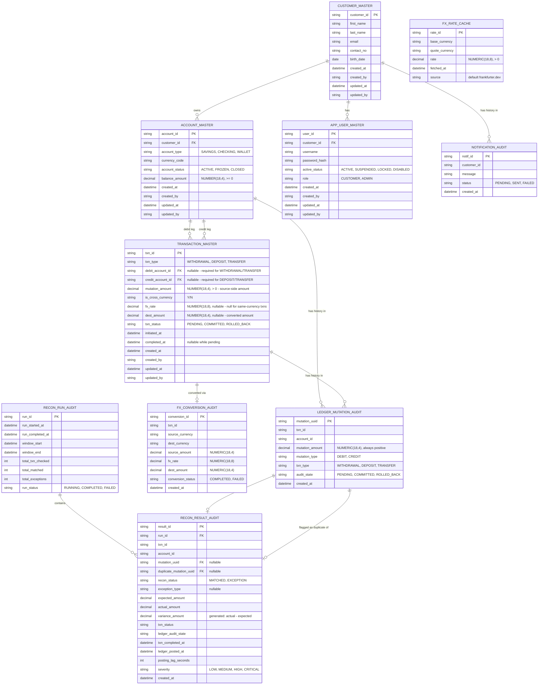

```mermaid
erDiagram
    %% ===== ORACLE XE 21c - MASTER DB =====
    CUSTOMER_MASTER ||--o{ ACCOUNT_MASTER : owns
    CUSTOMER_MASTER ||--o{ APP_USER_MASTER : has
    ACCOUNT_MASTER ||--o{ TRANSACTION_MASTER : "debit leg"
    ACCOUNT_MASTER ||--o{ TRANSACTION_MASTER : "credit leg"

    %% ===== cross-database (logical, not enforced FKs) =====
    CUSTOMER_MASTER ||--o{ NOTIFICATION_AUDIT : "has history in"
    ACCOUNT_MASTER ||--o{ LEDGER_MUTATION_AUDIT : "has history in"
    TRANSACTION_MASTER ||--o{ LEDGER_MUTATION_AUDIT : "has history in"
    TRANSACTION_MASTER ||--o| FX_CONVERSION_AUDIT : "converted via"

    %% ===== POSTGRESQL 15+ - AUDIT DB (incl. ForEx Service tables) =====
    RECON_RUN_AUDIT ||--o{ RECON_RESULT_AUDIT : contains
    LEDGER_MUTATION_AUDIT ||--o| RECON_RESULT_AUDIT : "matched by"
    LEDGER_MUTATION_AUDIT ||--o| RECON_RESULT_AUDIT : "flagged as duplicate of"

    CUSTOMER_MASTER {
        string customer_id PK
        string first_name
        string last_name
        string email
        string contact_no
        date birth_date
        datetime created_at
        string created_by
        datetime updated_at
        string updated_by
    }

    ACCOUNT_MASTER {
        string account_id PK
        string customer_id FK
        string account_type "SAVINGS, CHECKING, WALLET"
        string currency_code
        string account_status "ACTIVE, FROZEN, CLOSED"
        decimal balance_amount "NUMBER(18,4), >= 0"
        datetime created_at
        string created_by
        datetime updated_at
        string updated_by
    }

    APP_USER_MASTER {
        string user_id PK
        string customer_id FK
        string username
        string password_hash
        string active_status "ACTIVE, SUSPENDED, LOCKED, DISABLED"
        string role "CUSTOMER, ADMIN"
        datetime created_at
        string created_by
        datetime updated_at
        string updated_by
    }

    TRANSACTION_MASTER {
        string txn_id PK
        string txn_type "WITHDRAWAL, DEPOSIT, TRANSFER"
        string debit_account_id FK "nullable - required for WITHDRAWAL/TRANSFER"
        string credit_account_id FK "nullable - required for DEPOSIT/TRANSFER"
        decimal mutation_amount "NUMBER(18,4), > 0 - source-side amount"
        string is_cross_currency "Y/N"
        decimal fx_rate "NUMBER(18,8), nullable - null for same-currency txns"
        decimal dest_amount "NUMBER(18,4), nullable - converted amount"
        string txn_status "PENDING, COMMITTED, ROLLED_BACK"
        datetime initiated_at
        datetime completed_at "nullable while pending"
        datetime created_at
        string created_by
        datetime updated_at
        string updated_by
    }

    NOTIFICATION_AUDIT {
        string notif_id PK
        string customer_id
        string message
        string status "PENDING, SENT, FAILED"
        datetime created_at
    }

    LEDGER_MUTATION_AUDIT {
        string mutation_uuid PK
        string txn_id
        string account_id
        decimal mutation_amount "NUMERIC(18,4), always positive"
        string mutation_type "DEBIT, CREDIT"
        string txn_type "WITHDRAWAL, DEPOSIT, TRANSFER"
        string audit_state "PENDING, COMMITTED, ROLLED_BACK"
        datetime created_at
    }

    RECON_RUN_AUDIT {
        string run_id PK
        datetime run_started_at
        datetime run_completed_at
        datetime window_start
        datetime window_end
        int total_txn_checked
        int total_matched
        int total_exceptions
        string run_status "RUNNING, COMPLETED, FAILED"
    }

    RECON_RESULT_AUDIT {
        string result_id PK
        string run_id FK
        string txn_id
        string account_id
        string mutation_uuid FK "nullable"
        string duplicate_mutation_uuid FK "nullable"
        string recon_status "MATCHED, EXCEPTION"
        string exception_type "nullable"
        decimal expected_amount
        decimal actual_amount
        decimal variance_amount "generated: actual - expected"
        string txn_status
        string ledger_audit_state
        datetime txn_completed_at
        datetime ledger_posted_at
        int posting_lag_seconds
        string severity "LOW, MEDIUM, HIGH, CRITICAL"
        datetime created_at
    }

    FX_CONVERSION_AUDIT {
        string conversion_id PK
        string txn_id
        string source_currency
        string dest_currency
        decimal source_amount "NUMERIC(18,4)"
        decimal fx_rate "NUMERIC(18,8)"
        decimal dest_amount "NUMERIC(18,4)"
        string conversion_status "COMPLETED, FAILED"
        datetime created_at
    }

    FX_RATE_CACHE {
        string rate_id PK
        string base_currency
        string quote_currency
        decimal rate "NUMERIC(18,8), > 0"
        datetime fetched_at
        string source "default frankfurter.dev"
    }

```