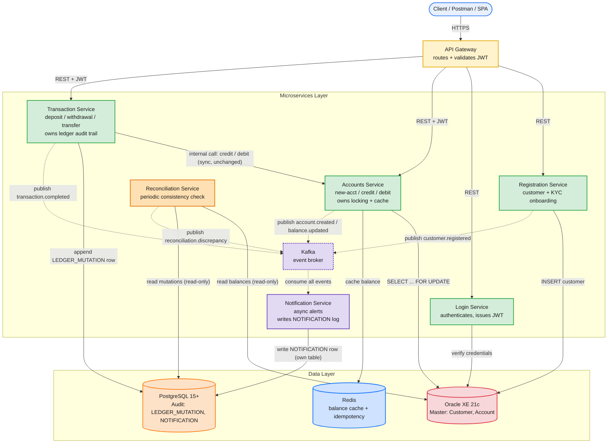

Good — I went through the ERD revision, the design review, and the current architecture. Here's the Day 1 revision covering the three required changes, plus what the review flags mean for it.

## The tension in "all services connected to Kafka"

Before the diagram — this requirement needs one clarification, because it can mean two very different things:

- **Literal reading:** replace the synchronous `Txn → Acct` call with a Kafka event.
- **Practical reading:** every service *also* publishes domain events to Kafka, while the request/response path that needs an immediate answer (like "was this debit approved?") stays synchronous REST.

I'd recommend the second. Kafka is fire-and-forget — there's no built-in request/response, so if Transaction Service published a "please debit" event instead of calling Accounts directly, it would have no way to know synchronously whether the debit succeeded, which breaks the client-facing response and the 50ms p95 SLA the spec calls out. The locking call has to stay a direct call.

So the recommended design: **Registration, Accounts, Transaction, and Reconciliation each publish events to Kafka** (satisfying "all services connected to Kafka" for eventing/decoupling purposes), while the one call that needs an immediate answer — `Txn → Acct` — stays synchronous REST, unchanged. Worth a one-line note in the report explaining *why* that call is the exception, since it's a natural question in a demo/defense.

## Updated architecture

## What changed, and why

**Kafka as the eventing backbone** — Registration, Accounts, Transaction, and the new Reconciliation Service each publish a domain event on state changes (`customer.registered`, `account.created`/`balance.updated`, `transaction.completed`, `reconciliation.discrepancy`). Notification Service is the single consumer of all of them. Login Service is deliberately left out of the eventing picture for now — a `login.failed` event for security monitoring is a reasonable future addition, but it's not needed for the core ledger flow and would just add scope. Worth flagging to the team as a scoping decision rather than an oversight.

**Notification Service → Audit DB** — rather than Notification reading from `LEDGER_MUTATION` (which would tightly couple it to Transaction Service's schema), it gets everything it needs from the Kafka event payload and *writes* a delivery record to its own `NOTIFICATION` table in the same PostgreSQL instance. This technically makes PostgreSQL a two-writer database now (Transaction writes `LEDGER_MUTATION`, Notification writes `NOTIFICATION`), which slightly loosens the "single writer per database" principle from the design review — but it preserves the tighter version of it: **single writer per table**. That distinction is worth stating explicitly in your report, since a grader who read the review will likely ask about it.

**Reconciliation Service (new)** — a scheduled job (not request-driven), reading Oracle balances and summed `LEDGER_MUTATION` rows per account, comparing them, and publishing a `reconciliation.discrepancy` event when they don't match. It's read-only against both databases, so it can't introduce new consistency bugs — it only reports them. This directly answers the "verify consistency between master and audit DBs" requirement, and it's also the concrete implementation of the audit trail's stated purpose ("prove no balance changed without a matching entry") from your Day 1 report.

