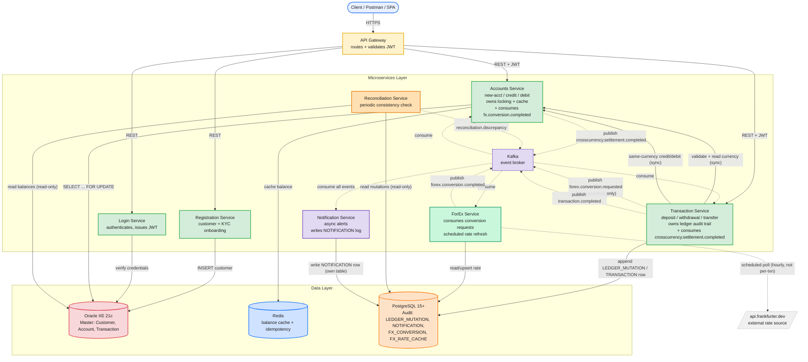

## Architecture diagram (v4)

Notice **Login and Registration have no Kafka edges** — matches last message's decision, and now the diagram visually makes the point for you in a defense: only the genuinely async, critical-path pair (Transaction ↔ ForEx ↔ Accounts) and the always-async Notification/Reconciliation paths touch the broker.

