## Architecture (v5 — final)

```mermaid
%% Core Retail Ledger & Balance Mutation Engine — FINAL system architecture (v5)
%% Solid = synchronous REST | Dashed = async Kafka event | Dotted = external/non-critical

flowchart TD
    Client(["<b>Client / Postman / SPA</b>"]):::client
    GW["<b>API Gateway</b><br/><span style='font-size:12px'>routes + validates JWT</span>"]:::gateway
    FXApi[/"<b>api.frankfurter.dev</b><br/><span style='font-size:12px'>external rate source</span>"/]:::external

    subgraph Services["Microservices Layer"]
        direction TB
        Reg["<b>Registration Service</b><br/><span style='font-size:12px'>customer + KYC onboarding</span>"]:::service
        Login["<b>Login Service</b><br/><span style='font-size:12px'>authenticates, issues JWT</span>"]:::service
        Acct["<b>Accounts Service</b><br/><span style='font-size:12px'>owns locking, mutation, Redis cache<br/>consumes <code>forex.conversion.completed</code></span>"]:::service
        Txn["<b>Transaction Service</b><br/><span style='font-size:12px'>orchestrates deposit/withdrawal/transfer<br/>owns <code>transaction_master</code> + ledger audit<br/>consumes <code>crosscurrency.settlement.completed</code></span>"]:::service
        FX["<b>ForEx Service</b><br/><span style='font-size:12px'>consumes <code>forex.conversion.requested</code><br/>scheduled rate refresh</span>"]:::fx
        Kafka["<b>Kafka</b><br/><span style='font-size:12px'>event broker</span>"]:::broker
        Notif["<b>Notification Service</b><br/><span style='font-size:12px'>async alerts, writes <code>notification_audit</code></span>"]:::notif
        Recon["<b>Reconciliation Service</b><br/><span style='font-size:12px'>periodic consistency check</span>"]:::recon
    end

    subgraph Data["Data Layer"]
        direction TB
        Oracle[("<b>Oracle XE 21c</b><br/><span style='font-size:12px'><code>customer_master</code>, <code>account_master</code>,<br/><code>app_user_master</code>, <code>transaction_master</code>,<br/><code>outbox_master</code></span>")]:::master
        Redis[("<b>Redis</b><br/><span style='font-size:12px'>balance cache + idempotency</span>")]:::cache
        PG[("<b>PostgreSQL 15+</b><br/><span style='font-size:12px'><code>ledger_mutation_audit</code>, <code>notification_audit</code>,<br/><code>fx_conversion_audit</code>, <code>fx_rate_cache</code>,<br/><code>recon_run_audit</code>, <code>recon_result_audit</code>,<br/><code>outbox_audit</code></span>")]:::audit
    end

    Client -->|HTTPS| GW
    GW -->|REST| Reg
    GW -->|REST| Login
    GW -->|"REST + JWT"| Acct
    GW -->|"REST + JWT"| Txn

    Reg -->|"INSERT <code>customer_master</code>"| Oracle
    Login -->|"verify <code>app_user_master</code>"| Oracle

    Txn -->|"validate + read currency (sync)"| Acct
    Txn -->|"same-currency credit/debit (sync)"| Acct
    Acct -->|"<code>SELECT ... FOR UPDATE</code> on <code>account_master</code>"| Oracle
    Acct -->|"cache balance"| Redis
    Acct -->|"write <code>outbox_master</code> row (same txn)"| Oracle

    Txn -->|"append <code>ledger_mutation_audit</code> +<br/>write <code>outbox_audit</code> row (same txn)"| PG
    Txn -->|"update <code>transaction_master</code> status<br/>(best-effort, reconciliation-checked)"| Oracle

    Txn -.->|"relay publishes <code>forex.conversion.requested</code><br/>(cross-currency only)"| Kafka
    Kafka -.->|"FX consumes <code>forex.conversion.requested</code>"| FX
    FX -.->|"relay publishes <code>forex.conversion.completed</code>"| Kafka
    Kafka -.->|"Accounts consumes <code>forex.conversion.completed</code>"| Acct
    Acct -.->|"relay publishes <code>crosscurrency.settlement.completed</code>"| Kafka
    Kafka -.->|"Transaction consumes <code>crosscurrency.settlement.completed</code>"| Txn

    FX -->|"read + upsert <code>fx_rate_cache</code>"| PG
    FX -->|"write <code>fx_conversion_audit</code> +<br/><code>outbox_audit</code> row (same txn)"| PG
    FX -.->|"scheduled poll (hourly, not per-txn)"| FXApi

    Recon -->|"read balances (read-only)"| Oracle
    Recon -->|"read mutations (read-only)"| PG
    Recon -->|"write <code>recon_run_audit</code>/<code>recon_result_audit</code> +<br/><code>outbox_audit</code> row (same txn)"| PG

    Acct -.->|"relay publishes <code>account.created</code> / <code>balance.updated</code>"| Kafka
    Txn -.->|"relay publishes <code>transaction.completed</code>"| Kafka
    Recon -.->|"relay publishes <code>reconciliation.discrepancy</code>"| Kafka
    Kafka -.->|"Notification consumes all events"| Notif
    Notif -->|"write <code>notification_audit</code> (own table)"| PG

    classDef client fill:#e8f0fe,stroke:#4285f4,stroke-width:2px,color:#1a1a1a,font-weight:bold
    classDef gateway fill:#fff3cd,stroke:#e6a700,stroke-width:2px,color:#1a1a1a,font-weight:bold
    classDef service fill:#d4edda,stroke:#28a745,stroke-width:2px,color:#1a1a1a,font-weight:bold
    classDef fx fill:#c9f7dc,stroke:#0f9960,stroke-width:2px,color:#1a1a1a,font-weight:bold
    classDef notif fill:#e2d9f3,stroke:#6f42c1,stroke-width:2px,color:#1a1a1a,font-weight:bold
    classDef recon fill:#ffe0b3,stroke:#e67300,stroke-width:2px,color:#1a1a1a,font-weight:bold
    classDef broker fill:#e2d9f3,stroke:#6f42c1,stroke-width:2px,color:#1a1a1a,stroke-dasharray: 4 2,font-weight:bold
    classDef master fill:#f8d7da,stroke:#dc3545,stroke-width:2px,color:#1a1a1a,font-weight:bold
    classDef audit fill:#fde2c8,stroke:#fd7e14,stroke-width:2px,color:#1a1a1a,font-weight:bold
    classDef cache fill:#cfe2ff,stroke:#0d6efd,stroke-width:2px,color:#1a1a1a,font-weight:bold
    classDef external fill:#f0f0f0,stroke:#888,stroke-width:1px,color:#1a1a1a,stroke-dasharray: 2 2,font-weight:bold
```

Note on the outbox rename per your instruction: **`outbox_audit`** (Postgres, shared) and **`outbox_master`** (Oracle, shared) — the "master/audit" naming mirrors your existing database naming convention (Oracle = master data, Postgres = audit trail), so the outbox names now read as "the queue that lives alongside the master DB" and "the queue that lives alongside the audit DB" — consistent and self-explanatory without needing "transaction" in the name at all. Both carry a `source_service` column for parity, even though `outbox_master` currently has only one real writer (Accounts) — documented as a deliberate simplicity trade-off, not an oversight.

---

## Component write-up, in plain terms

**Client** — Whatever app or tool a person uses to interact with the bank: a mobile app, a website, or (during development) Postman. It never talks to a service directly; every request goes through the Gateway.

**API Gateway** — The building's front door and security guard combined. Every request comes through here first. It checks your ID (JWT token) before letting you into anything sensitive, then points you toward the right service.

**Registration Service** — Handles signing up a new customer: takes their info, checks it, and creates their customer record.

**Login Service** — Checks your username and password, and if they're correct, hands you a signed token (like a temporary access badge) that proves who you are for the rest of your session.

**Accounts Service** — The vault keeper. It's the *only* place in the whole system allowed to actually change a balance. Before changing anything, it puts a lock on the account so two requests can't collide and cause a wrong number (imagine two people trying to withdraw the last $10 from an ATM at the exact same second — this is what prevents that). It also keeps a fast, temporary copy of your balance in a cache (Redis) so repeated balance checks don't have to hit the slower main database every time.

**Transaction Service** — The teller who takes your request ("I want to deposit," "I want to transfer") and coordinates what needs to happen. It doesn't touch balances itself — it asks Accounts Service to do that — but it's responsible for writing down a permanent, unchangeable record of every transaction (the "ledger"), so there's always a paper trail proving what happened.

**ForEx Service** — The currency exchange counter. When a transfer moves money between two different currencies (say, pesos to dollars), this service figures out the exchange rate and calculates the converted amount. It checks its own locally-stored rate table rather than calling an external website every single time — like a currency exchange booth that updates its rate board once an hour instead of looking it up for every single customer, so it's fast and doesn't grind to a halt if the outside rate provider is briefly unreachable.

**Kafka (event broker)** — Think of this as an internal postal service between departments. Instead of one service calling another and waiting on the line for an answer, a service can just drop a "message" in the mail (a completed transaction, a rate conversion result) and whichever other service needs to know about it picks it up whenever it's ready. This keeps slow or non-urgent steps from holding up the main transaction.

**Notification Service** — The department that sends you an alert (an email, an SMS, whatever) once something has happened. It's deliberately "off to the side" — if it's slow or temporarily down, your money still moves correctly; you just get notified a little late.

**Reconciliation Service** — The internal auditor. On a regular schedule, it quietly compares "what the vault says the balances are" against "what the ledger says should have happened," and flags anything that doesn't line up — like a manager double-checking the till at the end of each shift, even though the register already recorded every sale.

**Oracle XE (Master Database)** — The official, current record of who your customers are, what accounts exist, and what each account's live balance is right now. This is the "current truth."

**PostgreSQL (Audit Database)** — The permanent history book: every transaction that ever happened, every currency conversion, every reconciliation check, every notification sent. Nothing here ever gets edited or erased once written — only added to — so it can always be trusted as a record of "what actually happened."

**Redis (Cache)** — A short-term memory layer that holds recently-checked balances, so the system doesn't have to go all the way to the main database every time someone just wants to glance at their balance.

**`outbox_master` / `outbox_audit`** — These are the safety nets that make sure a message never gets "lost in the mail." Whenever a service changes something important (like a balance or a ledger entry) *and* needs to tell another service about it, it writes both the change and a note-to-self ("send this message") in the exact same instant, as one atomic action. A separate small process then checks that note-to-self list regularly and actually sends the message. This guarantees that if the system crashes at the worst possible moment, you never end up in a state where something changed but nobody who needed to know actually found out.

**api.frankfurter.dev (external rate source)** — A free, real, outside source for currency exchange rates. ForEx Service checks in with it periodically (not on every transaction) to keep its local rate table fresh — real integration with a live data source, without letting your core banking system depend on an outside website staying up every second.