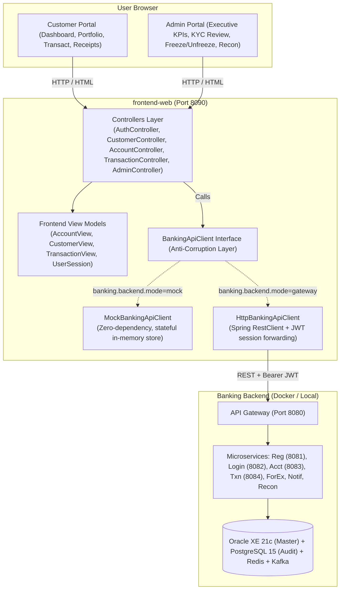

# Core Retail Ledger & Banking System — Frontend Wiring & Contract Guide

This guide explains how the Thymeleaf frontend application (`frontend-web`) is structured, how it communicates with the banking microservices architecture, and how to wire it up or adapt it when backend API contracts change.

---

## 1. Architectural Overview

The frontend is built with **Spring Boot 3.3**, **Thymeleaf**, and **Bootstrap 5.3**. It is intentionally architected around an **Anti-Corruption Layer (Adapter Pattern)** to decouple the user interface from backend API changes.



---

## 2. Configuration & Modes

The frontend supports two operating modes configured in `frontend-web/src/main/resources/application.yml`:

```yaml
server:
  port: 8090   # Port 8090 avoids conflict with API Gateway on 8080

spring:
  application:
    name: frontend-web
  thymeleaf:
    cache: false # Live template reloading during development

banking:
  backend:
    mode: mock   # Options: 'mock' or 'gateway'
    gateway-url: http://localhost:8080
    connect-timeout-ms: 3000
    read-timeout-ms: 5000
```

### Mode Comparison:

| Feature | Mock Mode (`mode: mock`) | Gateway Mode (`mode: gateway`) |
| :--- | :--- | :--- |
| **Dependencies** | **Zero.** Runs standalone without Docker or database setup. | Requires `docker compose up` or microservices running. |
| **Target URL** | In-memory thread-safe datastore. | `http://localhost:8080` (API Gateway). |
| **Authentication** | Pre-seeded personas (Admin, Juan, Maria). | Issues real JWT token via Login Service. |
| **Best Used For** | UI development, grading, presentations, defenses. | End-to-end integration and staging deployments. |

---

## 3. Pre-Seeded Demo Personas (One-Click Testing)

When running in mock mode, you can toggle between user perspectives instantly using the **Quick Switch bar** at the top of every page:

1. **System Administrator** (`admin@ledgerbank.com` / `admin123`):
   - Access to `/admin/dashboard`: Executive liquidity metrics (consolidated PHP sum of all accounts), account distribution breakdown.
   - Access to `/admin/customers`: Review KYC identity documents and Approve/Reject customer applications.
   - Access to `/admin/accounts`: Freeze or Unfreeze customer accounts with immediate effect on balance mutations.
   - Access to `/admin/reconciliation`: Inspect `RECON_RUN_AUDIT` batch runs and flagged variance exceptions in `RECON_RESULT_AUDIT`.
   - Access to `/transactions/history`: Full system ledger audit trail.

2. **Customer: Juan Dela Cruz** (`juan.delacruz@example.com` / `password123`):
   - Verified KYC status.
   - Dual-currency portfolio: `ACCT-1001-PHP` (Savings: ₱45,250.00) and `ACCT-1002-USD` (Checking: $1,500.00).
   - Real-time fund transfers, printable transaction receipt vouchers, account statement ledger.

3. **Customer: Maria Santos** (`maria.santos@example.com` / `password123`):
   - Tri-currency portfolio: `ACCT-2001-PHP` (₱128,400.00), `ACCT-2002-PHP` (Wallet: ₱4,750.50), and `ACCT-2003-EUR` (€3,200.00).
   - Test cross-currency transfers (PHP to EUR or PHP to USD) with live ForEx rate conversion.

---

## 4. How to Wire Up with the Real Backend

To wire the frontend to the real backend microservices running in Docker Compose:

### Step 1: Start Backend Services
From the root repository directory:
```bash
docker compose up -d
```
Verify the gateway is responding:
```bash
curl http://localhost:8080/actuator/health
```

### Step 2: Switch Frontend Configuration
In `frontend-web/src/main/resources/application.yml`, change `mode` to `gateway`:
```yaml
banking:
  backend:
    mode: gateway
    gateway-url: http://localhost:8080
```

### Step 3: Run Frontend Web
```bash
cd frontend-web
mvn spring-boot:run
```
Visit `http://localhost:8090`. Log in with your registered backend credentials. The frontend will authenticate against `/api/auth/login`, acquire the JWT, store it in the HTTP session, and attach `Authorization: Bearer <token>` on subsequent requests to `/api/accounts` and `/api/v1/ledger/mutate`.

---

## 5. API Contract Change Playbook

In a microservice banking platform, API contracts frequently evolve (e.g. fields renamed, date formats altered, payload envelopes restructured). 

### Why the Architecture Protects Your UI
Your Thymeleaf templates and UI Controllers **only** talk to the Frontend View Models:
- `AccountView`
- `CustomerView`
- `TransactionView`
- `UserSession`

They **never** bind directly to backend HTTP payloads. 

### Scenario 1: Backend Renames a Field
*Example:* The backend changes `customerId` to `customerUuid` in `/api/accounts`.

**Action Needed:**
1. Open `BackendDtos.java` in `com.capstone.ledger.frontend.adapter.dto`.
2. Update the record definition:
   ```java
   public record AccountRes(
       String accountId,
       String customerUuid, // <-- was customerId
       String accountType,
       ...
   ) {}
   ```
3. Update the mapping in `HttpBankingApiClient.java`:
   ```java
   private AccountView mapAccount(AccountRes res) {
       return new AccountView(
           res.accountId(),
           res.customerUuid(), // <-- map new field to existing view model
           ...
       );
   }
   ```
4. **Done!** None of your Thymeleaf templates (`detail.html`, `dashboard.html`) or controllers need to be touched.

### Scenario 2: Backend Changes Date Format
*Example:* The transaction timestamp changes from an ISO-8601 string (`"2026-09-24T05:10:00Z"`) to an Epoch timestamp (`1790226600000`).

**Action Needed:**
Update the single translation line in `HttpBankingApiClient.java`:
```java
// If epoch milliseconds:
LocalDateTime timestamp = Instant.ofEpochMilli(res.epochTimestamp())
                                 .atZone(ZoneId.systemDefault())
                                 .toLocalDateTime();
tv.setTimestamp(timestamp);
```
All Thymeleaf views continue using `#temporals.format(t.timestamp, 'dd MMM yyyy')` without error.

### Scenario 3: Backend Restructures Envelopes
*Example:* The backend stops wrapping responses in `{ "success": true, "data": { ... } }` and returns the object directly.

**Action Needed:**
In `HttpBankingApiClient.java`, change the `ParameterizedTypeReference`:
```java
// Before:
.body(new ParameterizedTypeReference<ApiResponseDto<AccountRes>>() {});

// After:
.body(AccountRes.class);
```

---

## 6. Critical Path User Journey

### Customer Journey:
1. **Registration & KYC (`/register`)**: Customer enters personal info, valid ID (Passport/National ID), residential address, and selects an initial account (`SAVINGS`, `CHECKING`, `WALLET`) and currency (`PHP`, `USD`, `EUR`). Status initialized to `PENDING_VERIFICATION`.
2. **Dashboard (`/customer/dashboard`)**: Displays consolidated balance across all accounts, status badges, and account cards.
3. **Open Account (`/accounts/open`)**: Provisions additional multi-currency accounts or digital wallets.
4. **Transact / Transfer (`/transactions/new`)**:
   - Choose operation: `DEPOSIT`, `WITHDRAWAL`, or `TRANSFER`.
   - If `TRANSFER` between different currencies (e.g. PHP -> USD), the system calculates the live ForEx rate and displays the estimated recipient amount.
   - Includes unique idempotency key generation.
5. **Voucher Receipt (`/transactions/receipt/{txnId}`)**: Generates an official digital voucher confirming transaction commit, mutation ID, and resulting balance.
6. **Alerts Inbox (`/notifications`)**: Simulates asynchronous SMS/Email alerts dispatched by Notification Service via Kafka.

### Administrator Journey:
1. **Executive Dashboard (`/admin/dashboard`)**: Real-time view of total system liquidity (PHP sum), customer count, active vs frozen accounts, pending KYC count, and live ledger stream.
2. **Customer Directory (`/admin/customers`)**: Review submitted KYC identity documentation and click **Approve** or **Reject**.
3. **Accounts Registry (`/admin/accounts`)**: View all accounts across all customers. Click **Freeze** to immediately lock an account (any subsequent mutation attempts will be blocked with an error).
4. **Reconciliation Monitor (`/admin/reconciliation`)**: Periodic audit job monitor verifying consistency between Master DB (Oracle XE) and Audit Log (Postgres). Displays flagged variance, posting lag, and severity ratings (`LOW`, `MEDIUM`, `HIGH`, `CRITICAL`), with a button to trigger batch reconciliation runs on demand.

